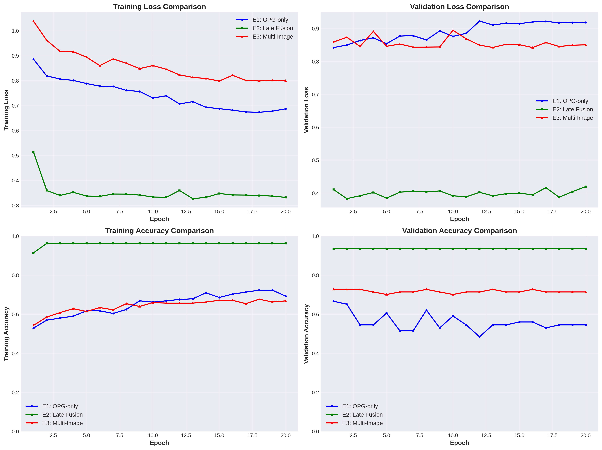
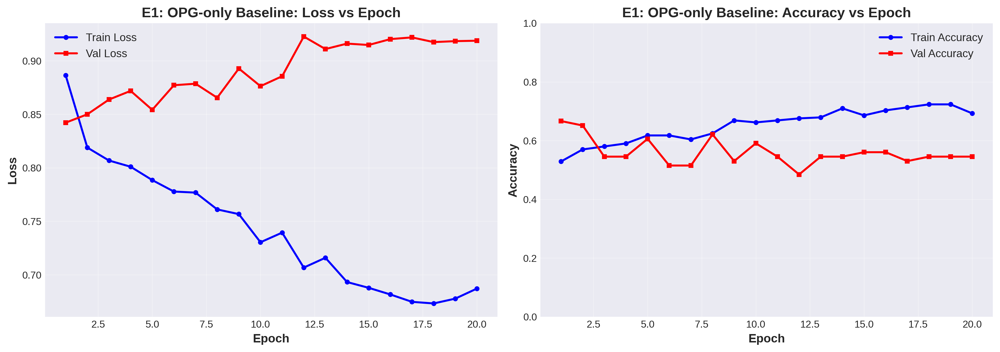
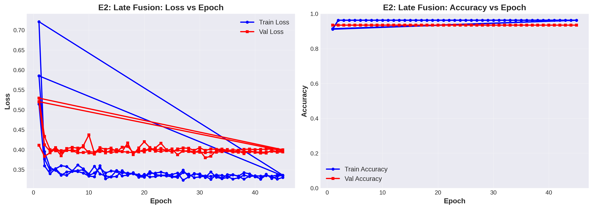

<!-- _class: lead -->
# Multi-Modal Deep Learning for Orthodontic Malocclusion Classification

**Comparing Three Experimental Approaches**

---

## Problem Statement

**Objective**: Three-class malocclusion classification (Class I, II, III)

**Challenge**: How to effectively leverage multi-modal medical imaging?

**Image Modalities**:
- **OPG** (Panoramic X-rays)
- **Intraoral** photographs
- **Cephalometric** X-rays

**Dataset**: 422 unique patients with patient-aware splitting (70/15/15)

---

## Experimental Approaches

| Experiment | Approach | Architecture |
|------------|----------|--------------|
| **E1** | OPG-only Baseline | MedGemma-4B (frozen) + classifier head |
| **E2** | Naïve Late Fusion | 3 CNNs (one per modality) + ensemble |
| **E3** | Multi-Image Prompting | MedGemma-4B with multi-image tokens |

**Key Question**: Does multi-modal fusion improve over single-modality baseline?

---

## Experiment 1: OPG-only Baseline

**Strategy**: Establish single-modality baseline using panoramic X-rays

**Architecture**:
- Frozen MedGemma-4B vision encoder (1152-dim features)
- Trainable classification head
- Robust 3-tier modality filtering

**Training**:
- 20 epochs, batch size 8
- AdamW optimizer, Cosine LR scheduler
- Only OPG images used

**Best Performance**: 66.67% validation accuracy (epoch 1)

---

## Experiment 2: Naïve Late Fusion

**Strategy**: Train separate classifiers per modality, fuse at decision level

**Architecture**:
- **Intraoral CNN**: SimpleClassifier (512-dim) → intraoral images
- **OPG CNN**: SimpleClassifier (512-dim) → panoramic X-rays
- **Ceph CNN**: SimpleClassifier (512-dim) → cephalometric X-rays
- **Fusion**: Average predictions from all three classifiers

**Training**: Sequential training, 45 epochs each modality

**Best Performance**: **93.51% validation accuracy** ⭐

---

## Experiment 3: Multi-Image Prompting

**Strategy**: Feed multiple images with specialized prompts to MedGemma

**Architecture**:
- Frozen MedGemma-4B encoder + classification head
- Multi-image input with `<start_of_image>` tokens
- Modality-aware prompt engineering

**Prompt Example**:
```
<start_of_image> <start_of_image> <start_of_image>
You are analyzing multiple orthodontic images...
Image 1 is a panoramic X-ray (OPG).
Image 2 is an intraoral photograph.
Image 3 is a lateral cephalometric X-ray.
```

**Best Performance**: 72.73% validation accuracy

---

## Results Comparison



---

## Training Dynamics

### E1: OPG-only Baseline


**Observation**: Shows overfitting - validation loss increases while training continues

---

## Training Dynamics (continued)

### E2: Late Fusion (Best Performer)


**Observation**: Extremely stable - maintains ~93.5% validation accuracy throughout

---

## Key Findings & Conclusions

**Performance Ranking**:
1. **E2 (Late Fusion)**: 93.51% ⭐ - Clear winner
2. **E3 (Multi-Image)**: 72.73% - Moderate improvement over baseline
3. **E1 (OPG-only)**: 66.67% - Baseline

**Insights**:
- ✅ Multi-modal fusion **significantly outperforms** single modality
- ✅ Simple late fusion beats sophisticated multi-image prompting
- ⚠️ E3 shows promise but may need more training or tuning
- ⚠️ E1 exhibits overfitting with frozen MedGemma encoder

**Recommendation**: Deploy E2 (Late Fusion) for production use

---
